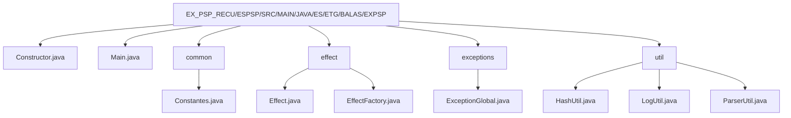

# Examen RA2 y RA5 Alvaro Balas Jiménez

## Descripción del proyecto
Proyecto java que simula un sistema de efectos visuales de un espectaculo. El sistema recibe datos de efectos, los procesa y genera resultados que se loguean.

## Que debe de tener el proyecto
(Lo que me acuerdo y he apuntado en mi cuaderno)

- Hilos para simular la concurrencia de efectos
- Logs para registrar la información de los efectos y resultados
- Excepciones personalizadas para manejar errores específicos del sistema (he hecho uno general pero se pueden añadir más si se quiere y personalizarlos)
- Synchronized para evitar problemas de concurrencia al acceder a recursos compartidos
- Hashing para generar identificadores únicos de los efectos y comprobar que se envian bien (tiene más sentido en server RA3 pero lo he utilizado en el momento antes de realizar el efecto, comprobar que el hash del efecto es correcto antes de procesarlo)
- Utilizar el mensaje tal y como venia en el enunciado de "X EFECTO", es decir "1 LUCES"

## Como he interpretado los pasos

1. Recibir datos de efectos (simulado con constantes en el código)
2. Crear efecto (parsear el mensaje para obtener cantidad y tipo)
3. Generar hash del efecto para verificar su integridad
4. Gestion y control
    - Comprobar hash antes de procesar el efecto
    - Procesar el efecto sea basico o epico
5. Logs de resultados (resultado del efecto y hash) 
6. Incluir manejo de excepciones para errores en el formato del mensaje o problemas durante el procesamiento del efecto

## Estructura del proyecto

## Algunas notas
- He utilizado constantes para simular la recepción de datos de efectos, pero en un sistema real esto vendría de una fuente externa (cliente - servidor)
- El efecto se procesa en función de su tipo (básico o épico) y se generan resultados diferentes
- El hash se utiliza para verificar que el efecto recibido es correcto antes de procesarlo, y se loguea tanto el resultado del efecto como su hash para tener un registro completo
- He incluido las constantes en un fichero separado para facilitar su gestión y modificación

## Errores que he tenido en el examen
- No me funcionaba el sistema de paqueteria de java en la maquina virtual Linux, ahora en mi casa bajo la misma maquina (porque estaba en un disco duro externo nvme) si funciona...
- Falta de sueño y nerviosismo en el examen

## Decision final
El codigo del examen a este es practicamente igual, solo que aqui ya he hecho las constantes en un fichero aparte, he mejorado los logs brevemente. No lo entregué porque... si no compila en mi maquina para entregarlo...
